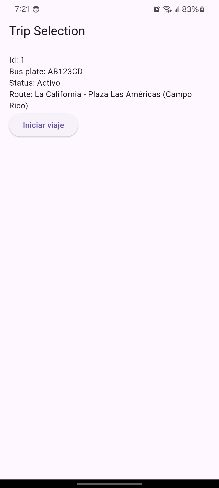
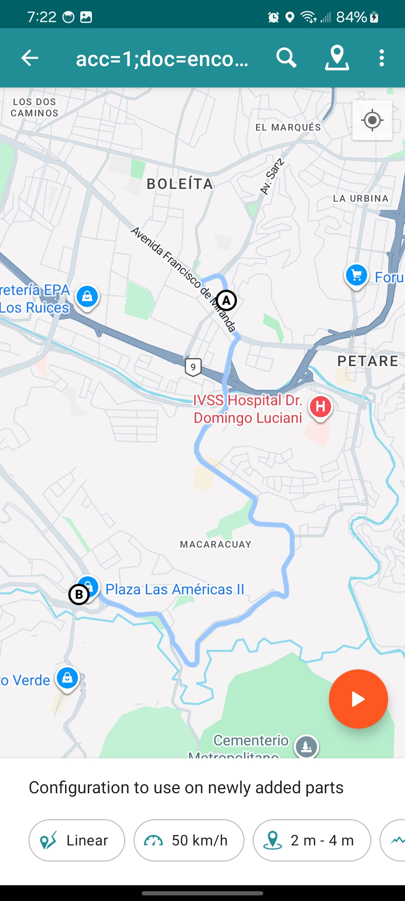
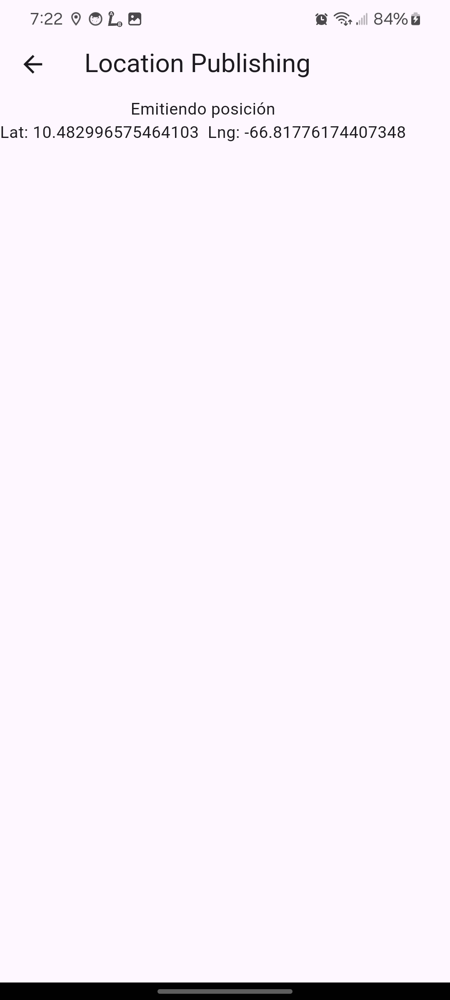

# Bus Tracker – Bus App

The goal of this project is to create a short app that allows students to see where the university bus is on its route.
**This app is for the bus; it will be responsible for showing the bus's location.** No login is required.

**Backend**: [bus-tracker-uni](https://github.com/abrahamuchos/bus-tracker-uni)<br/>
**Bus Tracker Student App**: [bus_tracker_app](https://github.com/abrahamuchos/bus_tracker_student_app)

## ✅ Features
- Show active trip
- Tracking location

## ⚙️ Tech Stack
- flutter 3.7
- flutter_bloc 9.1
- flutter_dotenv 6.0
- dio 5.10
- retrofit 4.6
- geolocator: 14


## 💾 Installation

Install and run

1. Clone and move to folder
```bash
$ git clone git@github.com:abrahamuchos/bus_tracker_app.git
$ cd bus_tracker_app
```

2. Install dependencies
```bash
$  flutter pub get
```

3. Config `.env` variables. Check `.env.example` to create file.

4. Run dev `flutter run`

If you encounter issues, run `flutter doctor` to check for missing dependencies or configuration errors.

## 📦 Environment Variables

To run this project, you will need to add the following environment variables to your .env file

```dotenv
API_BASE_URL=
```

## 📄 Docs
For the app to work correctly, it needs to connect to the backend ([bus-tracker-uni](https://github.com/abrahamuchos/bus-tracker-uni)).

### Resources for simulating route
If you are using a physical device, you can use [Lockito](https://play.google.com/store/apps/details?id=fr.dvilleneuve.lockito) to simulate the route.

To add the route, you can import it via KML.


## 📷 Screenshot





## 🧑‍💻 Authors
- [Portfolio - Abrahamuchos](https://abrahamuchos.onrender.com/)
- [@abrahamuchos](https://github.com/abrahamuchos)
- [Contact mail](mailto:abrahmuchos@gmail.com)


